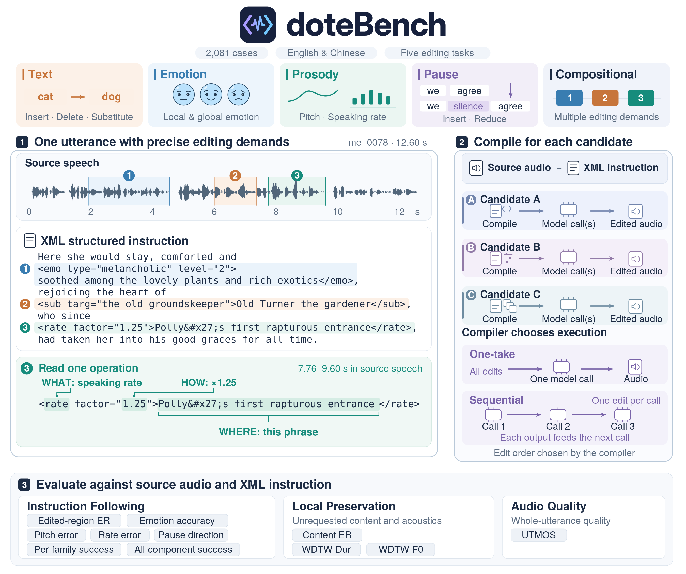
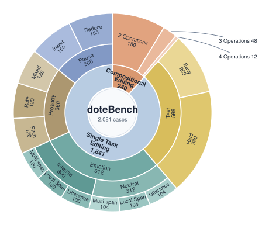
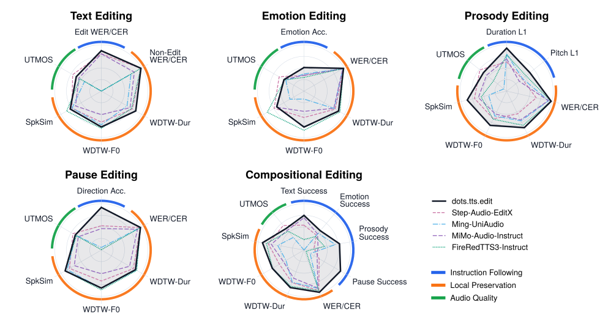
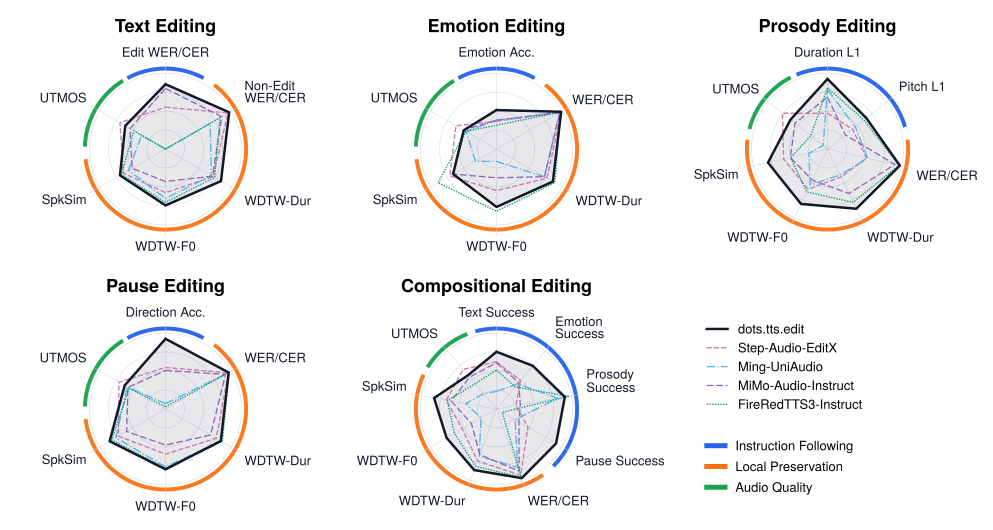

<div align="center">
  
  <p><strong>An XML-first bilingual benchmark for precise speech editing.</strong></p>
  <p>
    <a href="https://arxiv.org/abs/2608.02673"></a>
    
    <a href="LICENSE"></a>
    
  </p>
</div>

Precise speech editing must control both **what** an edit changes and **where**
it applies. doteBench is an XML-first bilingual evaluation suite that makes this
contract explicit, then evaluates systems along three complementary dimensions:
precise instruction following, local preservation outside the target region,
and overall audio quality. Dataset V1.0 (`v1_0`) contains **2,081 English and Chinese cases** across
Text, Emotion, Prosody, Pause, and Compositional editing, with deterministic data
materialization, candidate adapters, and the complete evaluator.

<p align="center">
  <a href="assets/benchmark-overview.svg"></a>
  <br>
  <em>doteBench overview. (1) A real utterance pairs source speech with an XML instruction specifying what to edit, where to edit, and the requested parameters. The three highlighted regions request emotion, text substitution, and speaking-rate edits. (2) Each candidate compiles the shared inputs into its own model calls, using one-take or sequential execution; the compiler determines edit order. (3) Evaluation measures instruction following, preservation outside the requested edits, and audio quality.</em>
</p>

doteBench is part of the [dots.tts](https://arxiv.org/abs/2606.07080) and
[dots.tts.edit](https://arxiv.org/abs/2608.02673) projects. To access the models,
visit the [dots.tts Project Page](https://studio-dots-ai.github.io/dots.tts-demo/),
the [dots.tts.edit Project Page](https://dots-studio-dots-tts-edit-demo.static.hf.space),
or the [GitHub Repo](https://github.com/studio-dots-ai/dots.tts).

## Benchmark at a glance

| Category | Shards | Cases | What is measured |
|---|---|---:|---|
| Text | easy, hard | 569 | Edited content and preservation outside the edit |
| Emotion | neutral, intense | 612 | Target emotion, content, speaker, and acoustic preservation |
| Prosody | default | 360 | Local pitch and speaking-rate control |
| Pause | default | 300 | Whether a pause changes in the requested direction |
| Compositional | default | 240 | Multiple edits over mutually exclusive regions in one instruction |

<p align="center">
  
  <br>
  <em>Distribution of the 2,081 benchmark cases across editing categories and operation types.</em>
</p>

<p align="center">
  
  <br>
  <em>One-take results: each case is compiled into a single model call; the radar compares instruction following, local preservation, and audio quality across 5 single-model candidate systems.</em>
</p>

<p align="center">
  
  <br>
  <em>Sequential results: each XML operation is applied in a separate model call, and each output becomes the input to the next; the radar compares instruction following, local preservation, and audio quality across 5 single-model candidate systems.</em>
</p>

### XML instruction is the operation authority

Every case contains a source-audio reference and one authoritative XML instruction:

```xml
Please say <sub targ="the revised line">the original line</sub>
with a <pitch semitones="3">higher pitch</pitch><pause act="ins"/> here.
```

The benchmark parser deterministically renders source and target transcripts
from that XML instruction. A candidate receives only the case ID, language,
source audio, and the XML instruction. It may use the standard renderer or
implement its own model-specific prompt construction. Compositional instructions
specify edits over mutually exclusive regions; the candidate compiler determines their execution order.
Frozen source alignments remain evaluation data and are not available to
candidates.

```text
XML instruction ──┬── render source/target text ── evaluation
                  └── candidate compiler ── model service ── edited audio
```

## Quick start

doteBench supports Python 3.10–3.12 and uses
[uv](https://docs.astral.sh/uv/) for reproducible environments.

~~~bash
git clone --recurse-submodules https://github.com/studio-dots-ai/doteBench.git
cd doteBench
export UV_PROJECT_ENVIRONMENT=/path/to/envs/dotebench-development
export UV_LINK_MODE=hardlink
uv sync --frozen --extra dev --extra metrics
uv run --frozen dotebench --help
~~~

## License & Third-Party Notices

doteBench-authored code and documentation are released under the
[Apache License 2.0](LICENSE).

Third-party software and its license information are listed in
[THIRD_PARTY_LICENSES.md](THIRD_PARTY_LICENSES.md).

Unless explicitly stated, this repository does not include or distribute
third-party model weights. Users who download or enable third-party models or
services must also comply with the applicable upstream software, model-weight,
and data terms.

Follow [Using doteBench](docs/usage.md) to verify the audio bundle, materialize the
complete data root, run a candidate, evaluate its outputs, and render a report.

The identity candidate copies source audio to check a materialized data root:

~~~bash
uv run --frozen dotebench generate \
  --candidate identity \
  --compiler one_take \
  --category text --shard easy \
  --data-root /path/to/materialized-data \
  --audio-root /path/to/materialized-data \
  --run /path/to/runs/identity-text-easy
~~~

## Candidate integrations

Each built-in integration documents its own model input, compiler behavior,
deployment parameters, and capability boundary beside the implementation:

- [dots.tts.edit](src/dotebench/candidates/dots_tts_edit/README.md)
- [AuK Base](src/dotebench/candidates/auk_base/README.md)
- [Ming-UniAudio](src/dotebench/candidates/ming_uniaudio/README.md)
- [Step-Audio-EditX](src/dotebench/candidates/step_audio_editx/README.md)
- [MiMo-Audio-Instruct](src/dotebench/candidates/mimo_audio_instruct/README.md)
- [FireRedTTS3-Instruct](src/dotebench/candidates/fireredtts3_instruct/README.md)

## Reference results

All values below cover the same 2,081 cases. Operation success averages the
measurable requested operations; all-operations success requires every
measurable operation in a case to succeed.

| Candidate | One-take operation success | Sequential operation success | One-take all operations | Sequential all operations |
|---|---:|---:|---:|---:|
| dots.tts.edit | **63.9%** | **64.4%** | **49.0%** | **49.5%** |
| MiMo-Audio-Instruct | 42.5% | 44.5% | 28.0% | 29.5% |
| Step-Audio-EditX | 40.6% | 36.1% | 26.9% | 22.9% |
| Ming-UniAudio | 23.5% | 27.9% | 10.8% | 16.1% |
| FireRedTTS3-Instruct | 19.7% | 26.7% | 9.1% | 15.8% |
| AuK + Qwen3-ForcedAligner* | 17.1% | 30.7% | 7.4% | 17.3% |

\* AuK is a non-autoregressive (NAR) model without native local editing.
The external forced aligner enables local span edits; this configuration is
reported in the table but omitted from the radar charts.

See the [evaluation protocol](docs/evaluation.md) for metric definitions and
failure handling. These figures summarize frozen, audited runs.

## Documentation

For benchmark users:

- [End-to-end usage](docs/usage.md)
- [Data and XML contract](docs/data.md)
- [Data materialization](docs/materialization.md)
- [Evaluation protocol](docs/evaluation.md)

For contributors:

- [Development and extension guide](docs/development.md)
- [Contributing](CONTRIBUTING.md)

Release terms and attribution are recorded in the
[data notice](release/DATA-NOTICE.md), [audio notice](release/AUDIO-NOTICE.md),
and root [NOTICE](NOTICE).

## License and citation

doteBench-authored code, XML markup, annotations, edit text, documentation, and
visual assets are released under the [Apache License 2.0](LICENSE). Upstream
transcripts, audio, model weights, and source repositories retain their own
terms; see [NOTICE](NOTICE), [the data notice](release/DATA-NOTICE.md), and [the
audio notice](release/AUDIO-NOTICE.md).

The benchmark is introduced in [*dots.tts.edit: Precisely Controlled Speech
Editing with a Continuous Autoregressive Model*](https://arxiv.org/abs/2608.02673).

```bibtex
@misc{wang2026dotsttsedit,
  title={dots.tts.edit: Precisely Controlled Speech Editing with a Continuous Autoregressive Model},
  author={Hankun Wang and Bohan Li and Shi Lian and Xiaoyu Gu and Jing Peng and Da Zheng and Yiwei Guo and Colin Zhang and Shuai Wang and Kai Yu},
  year={2026},
  eprint={2608.02673},
  archivePrefix={arXiv},
  primaryClass={cs.SD},
  doi={10.48550/arXiv.2608.02673},
  url={https://arxiv.org/abs/2608.02673}
}
```

Citation metadata is provided in [CITATION.cff](CITATION.cff).
